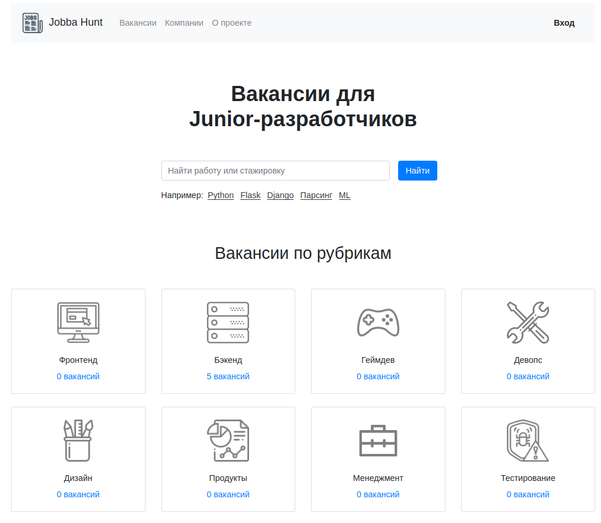

## Что реализованно

* Главная страница
* Страница всех вакансий
* Страница всех компаний
* Страница специализации
* Страница компании
* Страница вакансии



### Внимание

Данные проект содержит [db.sqlite3](db.sqlite3) и фикстурные данные в бд и в [fixtures_data.json](fixtures_data.json).

Этот проект реализован в образовательных целях.

#### Установка проекта

- установить версию python 3.8
  
- создать виртуальное окружение 
```shell script
python3.8 -m venv venv
```

- активировать виртуальное окружение
```shell script
source venv/bin/activate
```

- установить зависимости
```shell script
pip install -r requirements.txt
```

- запустить django-проект
```shell script
gunicorn jobba_hunt.wsgi
```

- открыть в браузере http://localhost:8000 
